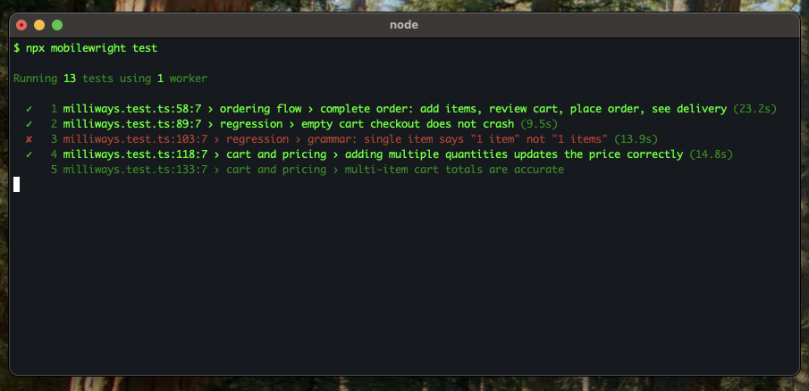
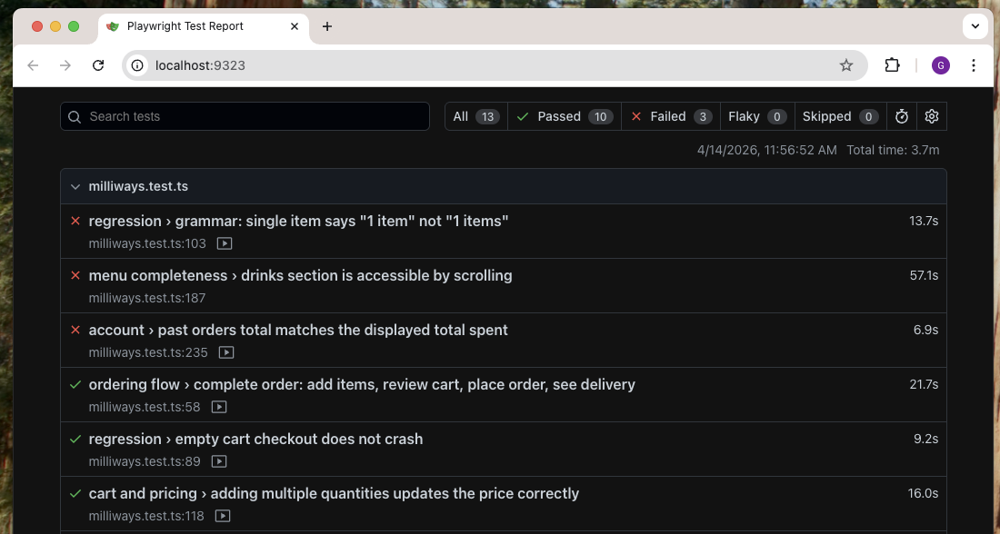

# Installation

## Introduction

Mobilewright is an end-to-end testing framework for mobile applications. It provides a TypeScript API for automating iOS and Android devices, with built-in auto-waiting, assertions, and test reporting.

- **Cross-platform** — iOS and Android, simulators, emulators and real devices
- **Auto-waiting** — No manual waits or sleeps
- **TypeScript-first** — Full type safety and autocompletion
- **Agent-ready** — Built for AI agent integration

## Installing Mobilewright

```bash
npm install mobilewright @mobilewright/test
```

Initialize a new project:

```bash
npx mobilewright init
```

This creates the configuration file and an example test. If either file already exists, it will be skipped.

## Directory layout

After initialization, your project will look like this:

```
mobilewright.config.ts
package.json
package-lock.json
tests/
  example.test.ts
```

The `mobilewright.config.ts` file defines your target platform, app bundle ID, and device:

```typescript
import { defineConfig } from 'mobilewright';

export default defineConfig({
  platform: 'ios',
  bundleId: 'com.example.myapp',
  deviceName: /iPhone 16/,
  timeout: 10_000,
});
```

The `tests/example.test.ts` file contains a starter test:

```typescript
import { test, expect } from '@mobilewright/test';

test('app launches and shows home screen', async ({ screen }) => {
  await expect(screen.getByText('Welcome')).toBeVisible();
});
```

## Running tests

Run the example test:

```bash
npx mobilewright test
```



## HTML test reports

Run tests with the HTML reporter:

```bash
npx mobilewright test --reporter html
```

After the test run, open the report:

```bash
npx mobilewright show-report
```

This starts a local server at `localhost:9323` with an interactive report where you can filter results, inspect errors, and view screenshots.


