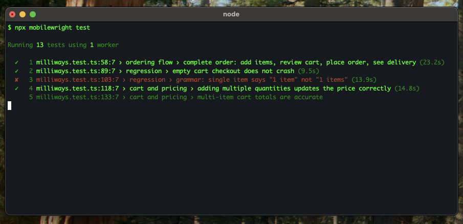
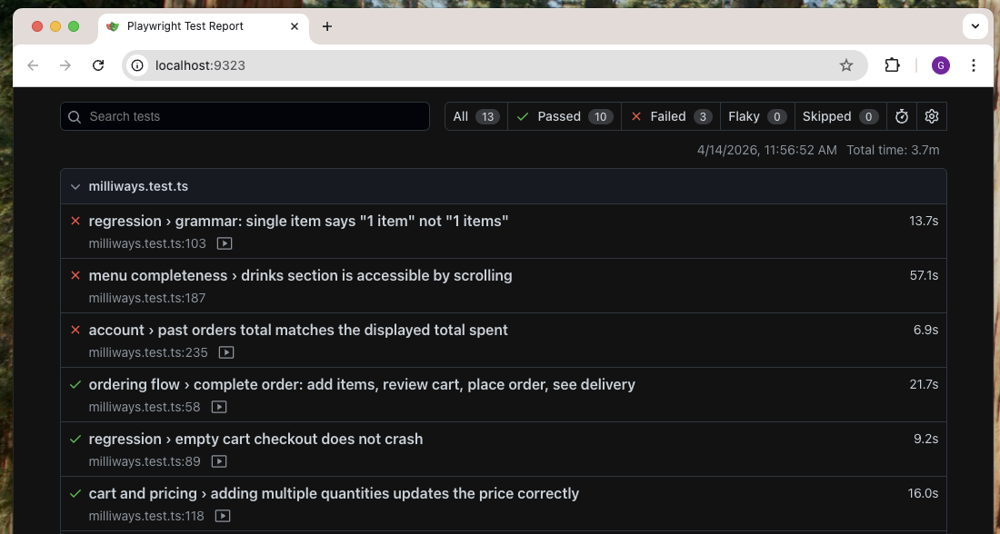

# Installation

## Introduction

Mobilewright is an end-to-end testing framework for mobile applications. It provides a TypeScript API for automating iOS and Android devices, with built-in auto-waiting, assertions, and test reporting.

- **Cross-platform** — iOS and Android, simulators, emulators and real devices
- **Auto-waiting** — No manual waits or sleeps
- **TypeScript-first** — Full type safety and autocompletion
- **Agent-ready** — Built for AI agent integration

## Requirements

Mobilewright drives real simulators, emulators and devices, so it needs a working mobile toolchain on your machine before the first test can run.

**Everywhere**

- Node.js 18 or newer.
- A booted simulator or emulator, or a device connected over USB. Mobilewright does not start one for you.

**For iOS**

- macOS 13 or newer.
- Xcode, plus the Xcode Command Line Tools.

**For Android**

- A JDK, version 11 or newer.
- The Android SDK, with `ANDROID_HOME` set and `adb` on your `PATH`.
- Works on macOS and Windows 11. On Linux, run Android tests through the [Docker image](../guides/docker.md).

You do not need to install [mobilecli](https://github.com/mobile-next/mobilecli) — it ships with the `mobilewright` package as a per-platform binary.

### Check your setup

`mobilewright doctor` verifies all of the above and tells you how to fix whatever is missing. Run it before anything else:

```bash
npx mobilewright doctor
```

```
mobilewright doctor  v0.0.1
────────────────────────────────────────────────────────────

  System
    ✓  macOS  macOS 15.7.4  [Apple Silicon (arm64)]
    ✓  Git  2.50.1 (Apple Git-155)
    ✓  Node.js  v22.19.0
    ✓  npm  10.9.3
    ✓  mobilecli  mobilecli version 0.3.66
    ✓  mobilecli devices  2 online devices
       iPhone (00008030-000E1D892340802E)
       iPhone 17 Pro (6A557392-1480-4355-9EBC-B1D12A0F665D)

  iOS
    ✓  Xcode  26.0.1 (17A400)
    ✓  Xcode Command Line Tools  /Applications/Xcode.app/Contents/Developer
    ✓  iOS Simulators  62 available, 2 booted

  Android
    ✓  Java (JDK)  21.0.10
    ✓  JAVA_HOME  /Library/Java/JavaVirtualMachines/temurin-21.jdk/Contents/Home
    ✓  ANDROID_HOME  /Users/john/Library/Android/sdk
    ✓  ADB (Android Debug Bridge)  1.0.41
    ✓  ADB Devices  0 devices connected
    ✓  Android Emulator  36.1.9.0
    ✓  Android SDK Platforms  API 35 (latest)  [4 platforms installed]
    ✓  Android Build Tools  35.0.0 (latest)  [3 versions installed]

────────────────────────────────────────────────────────────
  Summary  17 ok
  ✓ Ready for mobile development!
```

Every failing check comes with the commands that resolve it. See [Troubleshooting](../guides/troubleshooting.md) for the full breakdown and for `--json` output.

## Installing Mobilewright

Scaffold a new project:

```bash
npm init mobilewright@latest
```

This asks three questions — TypeScript or JavaScript, the directory to put tests in (default `tests`), and the bundle ID of the app under test — then writes the project files and runs `npm install` for you. If it finds an Xcode or Gradle project nearby it pre-fills the bundle ID.

To add Mobilewright to a project that already has a `package.json`, install it directly instead:

```bash
npm install --save-dev mobilewright @mobilewright/test
```

Note that `npm init mobilewright@latest` and `npx mobilewright init` are different commands
and produce different files. The former is the project scaffold described here; the latter is
a one-shot CLI helper that drops a config and an `example.test.ts` into the current directory
without prompting. See [Command Line](../test/cli.md#scaffold-a-project).

## Directory layout

After scaffolding, your project looks like this:

```
mobilewright.config.ts
package.json
package-lock.json
tests/
  example.spec.ts
```

The generated `mobilewright.config.ts` is deliberately minimal:

```typescript
import { defineConfig } from 'mobilewright';

export default defineConfig({
  testDir: './tests',
  bundleId: 'com.example.myapp',
  reporter: 'html',
});
```

And `tests/example.spec.ts` contains a starter test:

```typescript
import { test, expect } from '@mobilewright/test';

test('app launches and shows home screen', async ({ screen, device }) => {
  await expect(screen.getByText('Welcome')).toBeVisible();
});
```

This test asserts on the text `Welcome`, which almost certainly is not on your app's first screen — change it to something your app actually shows before running it.

## Choosing a device and installing your app

The scaffolded config does not pin a device, so Mobilewright uses the first one it finds. Add these options to target a specific device and to install a build before the test runs:

```typescript
import { defineConfig } from 'mobilewright';

export default defineConfig({
  testDir: './tests',
  platform: 'ios',
  deviceName: /iPhone 16/,
  bundleId: 'com.example.myapp',
  installApps: './builds/myapp.ipa',
  timeout: 10_000,
  reporter: 'html',
});
```

`installApps` takes a path to an `.ipa` or `.apk` and installs it on the device before launching. If your app is already installed, leave it out and set `bundleId` only. [Configuration](../test/configuration.md) documents every option.

## Running tests

Run the example test:

```bash
npx mobilewright test
```



## HTML test reports

Run tests with the HTML reporter:

```bash
npx mobilewright test --reporter html
```

After the test run, open the report:

```bash
npx mobilewright show-report
```

This starts a local server at `localhost:9323` with an interactive report where you can filter results, inspect errors, and view screenshots.



## What's next

- [Writing Tests](./writing-tests.md) — locators, actions and assertions.
- [Running Tests](./running-tests.md) — filtering, reporters and exit codes.
- [Configuration](../test/configuration.md) — every config option.
- [Inspector](../guides/inspector.md) — explore a live screen and find locators.
- [Setting up CI](./ci.md) — run the suite on every push.
